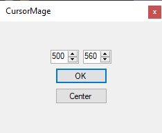

# CursorMage
Cursor Management Software!

## Center Button

Click the `Center` button to put your cursor at the exact center of your screen!

## X and Y Coorinates

Type your X and Y coordinates and click OK to put your cursor exactly where you want it!

# Contribution
> 👉 Please open an issue before contributing! [New Issue](https://github.com/finngreiter/CursorMage/issues/new)

Anyone can contribute! Even if your just requesting a feature.
